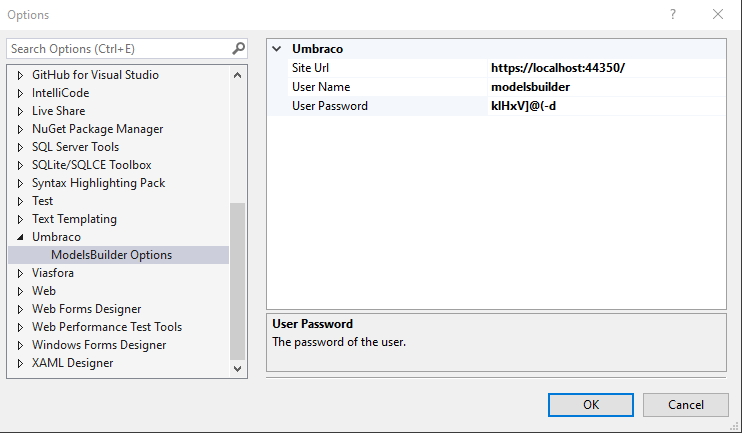
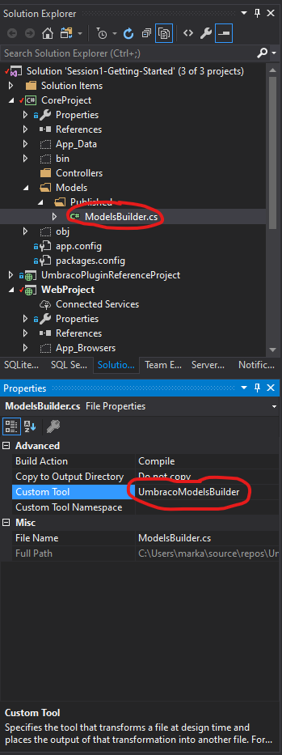
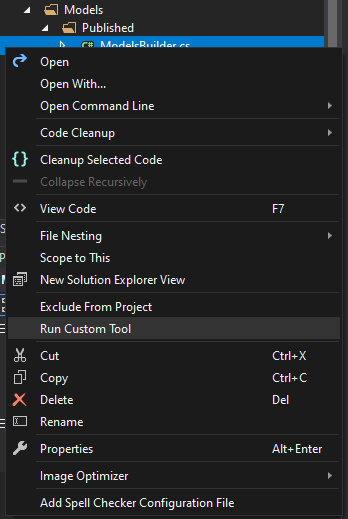
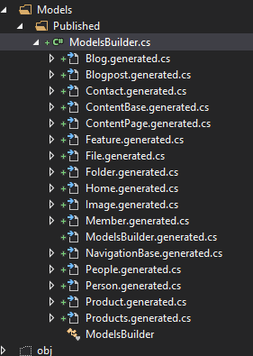

# Getting Started

Fork the project and clone.

Admin Umbraco Login: **Admin**

Password: **testwebsite1234**

## Known Issues

When cloning the site for the first time, after restoring nuget packages, configuring the site and running it, you may get an error "Could not find a part of the path 'C:\Users\johnsm13\Source\Repos\[your-folder]\Umbraco-Training-Demo\src\WebProject\bin\roslyn\csc.exe'"

I have found that the package "Microsoft.CodeDom.Providers.DotNetCompilerPlatform" does not always restore correctly (At the time of writing this, the installed version is 2.0.1).

The solution is to re-install the nuget package for the WebProject **(Ensure you run the command from the WebProject root)** using the command "Update-Package Microsoft.CodeDom.Providers.DotNetCompilerPlatform -r".

## Models Builder

Umbraco Models Builder is configured to use the Models Builder API. This will only run if debug mode (```<compilation debug="true" />``` in web.config) is set to true. 

### Setup

To make this work you will need to download the Models Builder extension for Visual Studio from the Marketplace: [Models Builder Extension](https://marketplace.visualstudio.com/items?itemName=ZpqrtBnk.UmbracoModelsBuilderExtension)

### Configure Extension

Once installed, it will need to be configured. Head to **Tools -> Options -> Umbraco -> ModelsBuilder Options** 
set:
Site Url: [your root website URL] (i.e. **https://localhost:44350/**)

Username: [your username, or the username of a user you have configured] (**modelsbuilder**)

User Password: [password for the above user] (**klHxV]@(-d**)
 

Models Builder Umbraco Login (for API configuration): **modelsbuilder**
Password: **klHxV]@(-d**

### Attach Custom Tool to parent/target content models class

Though this should already be configured in the solution, to attach the custom Umbraco Models Builder tool to a class, navigate to the class in solution explorer (the class can be in a referenced class library project as per this example solution), 
bring up the context menu for the class and select 'properties'.
In the properties window, add UmbracoModelsBuilder as the Custom Tool name property as per the following screenshot.



### Running the Umbraco Models Builder custom tool

With the website running (in debug mode), you can run the Models Builder Custom Tool by bringing up the context menu for the class you attached the Custom Tool to and selecting 'Run Custom Tool', see screenshot:



Once run, you should see a nested list of your generated models below the class the tool was run against:

